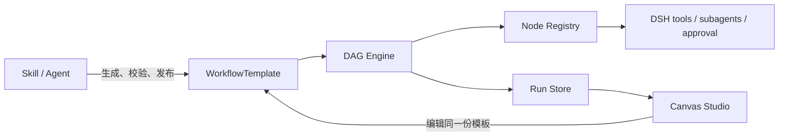

# DSH DAG Workflow

DSH DAG Workflow 是一套基于 [DeepSeek Harness](https://github.com/deepseek-ai/deepseek-harness) 插件体系的持久化 Workflow 能力：Skill 或 Agent 负责生成模板，DAG Engine 按模板执行，Canvas 直接编辑和观察同一份模板。

它不是对 DSH 现有动态 JavaScript workflow 的替代。动态 workflow 适合 Agent 临时规划和扇出任务；本项目解决需要保存、复用、版本化、审计、暂停恢复和可视化编排的流程。

## 设计



核心设计约束：

- **一个真源**：Agent、Engine 和 Canvas 都读写 `WorkflowTemplate`，不再维护第二套 Canvas DSL。
- **精确解析**：节点使用 `type@version`，发布后的 Workflow 和子流程固定到不可变 revision。
- **能力不越权**：`dsh.tool@1`、`dsh.agent@1`、`dsh.human-approval@1` 始终经过当前 DSH scope 的 tool、subagent、approval 和 owning Agent。
- **执行可恢复**：每次状态推进同时追加有序事件并提交 checkpoint；未知副作用不会自动重试，而是进入 `needs_attention`。
- **布局不污染语义**：节点位置和 viewport 位于 `layout`，移动节点只产生 layout diff，不改变 Workflow 的 semantic hash。

一个模板包含输入/输出 Schema、节点、边、binding、执行策略和可选布局：

```yaml
apiVersion: dsh.workflow/v1alpha1
kind: WorkflowTemplate
metadata:
  id: echo-message
  name: Echo message
spec:
  inputSchema:
    type: object
    required: [message]
    properties:
      message: { type: string }
  outputSchema:
    type: object
    required: [answer]
    properties:
      answer: { type: string }
  nodes:
    - id: start
      uses: core.start@1
      with: {}
      inputs: {}
    - id: echo
      uses: dsh.tool@1
      with: { name: echo }
      inputs:
        message: { input: message }
    - id: end
      uses: core.end@1
      with: {}
      inputs:
        answer: { output: { node: echo, path: [result, echo] } }
  edges:
    - { id: start-echo, source: start, target: echo }
    - { id: echo-end, source: echo, target: end }
  outputs:
    answer: { output: { node: end, path: [answer] } }
```

完整字段、校验规则和分支语义见 [Workflow Template v1 规范](spec/workflow-template-v1.md)，多 Agent 示例见 [research-report.workflow.yaml](examples/research-report.workflow.yaml)。

## 快速开始

要求 Node.js 22.19+。将完整 Workflow bundle 安装到 DSH Web profile：

```bash
dsh plugin --profile web add @gm-hz/dsh-dag-workflow
```

该命令会装配 DAG runtime、Agent authoring tools、`workflow-builder` Skill、SQLite 持久化和 Canvas Studio；默认数据库位于 DSH home 下的 `dsh-workflow/workflows.db`。

从源码开发和运行全部门禁需要 pnpm 11：

```bash
git clone https://github.com/GM-HZ/dsh-dag-workflow.git
cd dsh-dag-workflow
pnpm install
pnpm check
```

发布前也可以直接把当前 workspace 链接到本机 DSH，不需要先上传 npm：

```bash
pnpm build
dsh plugin --profile web add \
  "$PWD/packages/core" \
  "$PWD/packages/catalog" \
  "$PWD/packages/dsh" \
  "$PWD/packages/sqlite" \
  "$PWD/packages/canvas" \
  "$PWD/packages/bundle"
dsh web
```

打开任意顶层会话后，页面右下角会出现 `◇ FLOW`。本仓库提供了一个可直接执行的风险分流模板 [approval-gate.workflow.json](examples/approval-gate.workflow.json)：`riskScore > 70` 走 `true` 边，否则走 `false` 边，两路汇合并输出类型稳定的 `{ request, highRisk }`。

先单独验证模板和 DAG Engine：

```bash
pnpm demo
```

也可以将同一组本地包链接到本机 `headless` profile，再让真实 DSH Agent 创建、校验、发布和运行该模板。Web 与 Headless profile 默认共用 `$DSH_HOME/dsh-workflow/workflows.db`，因此 Agent 创建的模板会直接出现在 Canvas 的 OPEN 列表中。

需要定制存储或 Canvas authority 时，也可以只安装子包并在 DSH Host 中手动装配。最小内存版只需要 `@gm-hz/dsh-dag-workflow-host`：

```ts
import * as DagWorkflow from '@gm-hz/dsh-dag-workflow-host'

// Host 需要先提供 DSH 的 tools、subagents、approval 和 skills 服务。
await ctx.plugin(DagWorkflow)
```

插件会发布四个 Cordis service：

| Service | 用途 |
| --- | --- |
| `ctx.workflowNodes` | 注册并解析版本化节点 |
| `ctx.workflowTemplates` | draft、CAS 更新、diff、校验和发布 |
| `ctx.workflowRuns` | 事件日志与 checkpoint |
| `ctx.dagWorkflowEngine` | 启动、恢复和取消运行 |

内存 Provider 适合开发和测试。生产环境先挂载 SQLite Provider，再让主插件复用外部服务：

```ts
import {
  WorkflowNodeRegistryService,
} from '@gm-hz/dsh-dag-workflow-host'
import * as DagWorkflow from '@gm-hz/dsh-dag-workflow-host'
import {
  SqliteWorkflowRunsProvider,
  SqliteWorkflowTemplatesProvider,
} from '@gm-hz/dsh-dag-workflow-sqlite'

const database = { path: './data/workflows.db' }

await ctx.plugin(WorkflowNodeRegistryService)
await ctx.plugin(SqliteWorkflowTemplatesProvider, database)
await ctx.plugin(SqliteWorkflowRunsProvider, database)
await ctx.plugin(DagWorkflow, {
  catalog: 'external',
  runStore: 'external',
})
```

## 使用方式

### 1. 让 Agent 生成 Workflow

主插件会向 DSH 注册 `workflow-builder` Skill，以及下面八个受 DSH 策略保护的工具：

```text
workflow_nodes_list
workflow_draft_create
workflow_draft_read
workflow_draft_update
workflow_validate
workflow_diff
workflow_publish
workflow_run
```

可以直接对 Agent 表达目标，例如：

> 创建一个“研究主题 → 两路独立调研 → 汇总报告 → 人工确认”的 workflow。先展示校验结果和 diff，得到我确认后再发布，并运行发布的精确 revision。

Skill 引导 Agent 按 `查询节点 → 生成拓扑 → 创建 draft → 校验 → diff → 发布 → 运行` 的顺序工作。Skill 不绕过工具直接修改 Catalog，因此原有的 scope、guard、approval 和 observer 策略仍然生效。

### 2. 从代码执行

```ts
const published = ctx.workflowTemplates.getPublished('research-report', 1)
const run = ctx.dagWorkflowEngine.start({
  template: published.template,
  inputs: { topic: 'DSH plugin architecture' },
  parent: agent, // 发起运行并拥有权限的真实 DSH Agent
})

const result = await run.result
await run.dispose()

if (result.status === 'completed') {
  console.log(result.outputs)
}
```

`result` 会以 `completed`、`failed`、`cancelled` 或 `paused` 收敛。调用方持有 run，并应在读取结果后 `dispose()`。

恢复一个持久化运行：

```ts
const resumed = ctx.dagWorkflowEngine.resume({
  runId,
  parent: agent,
  unknownNodeResolutions: {
    charge: 'retry', // 也可以显式选择 'fail'
  },
})

const result = await resumed.result
await resumed.dispose()
```

### 3. 启用 Canvas Studio

Canvas 是独立插件。所有 RPC 会先通过 Host 的实时 Agent registry 解析 `sessionId`，只接受仍附着在当前 Host 的顶层 Agent。多人或多租户部署应继续按用户、workspace、action/resource 增加授权策略：

```ts
import * as WorkflowCanvas from '@gm-hz/dsh-dag-workflow-canvas'

await ctx.plugin(WorkflowCanvas, {
  authorize: async ({ sessionId, agent, action, resourceId }) => {
    return mayUseWorkflow(currentUserId(), agent, action, resourceId)
      ? { subject: currentUserId(), agent }
      : undefined
  },
})
```

省略 `authorize` 时使用面向本地单用户 profile 的默认边界：不存在、未附着或属于 subagent 的 session identity 会被拒绝，但 `sessionId` 本身不是多租户身份凭证。

包内的 `dsh.client` manifest 会加载 XYFlow Studio。Studio 支持节点和边编辑、Schema/config 编辑、诊断、CAS 保存、语义/布局 diff、发布、draft 测试运行、持久 trace，以及未知副作用的 retry/fail 决策。

其他 DSH Client 插件也可以打开同一个 overlay：

```ts
ctx.workflowCanvasUi.open({
  templateId: 'research-report',
  runId: 'dag-…',
  nodeId: 'summarize',
})
```

## 扩展节点

节点定义通过 `ctx.workflowNodes` 注册，返回 disposer，并随 Cordis scope 自动卸载：

```ts
ctx.effect(() => ctx.workflowNodes.register({
  type: 'acme.review',
  version: 1,
  title: 'Review',
  description: 'Run an internal review step.',
  role: 'regular',
  configSchema: { type: 'object', additionalProperties: false },
  inputSchema: { type: 'object' },
  outputSchema: { type: 'object' },
  outputPorts: ['default'],
  requiredOutputPorts: ['default'],
  capabilities: [],
  retry: 'safe',
  async execute(context) {
    return { outputs: { accepted: true, input: context.inputs } }
  },
}))
```

模板中使用 `acme.review@1`。如需自定义 Canvas 外观，Client 插件可额外注册同一 `uses` 对应的 React renderer；未注册时仍可使用通用节点编辑器。

## 可靠性与安全边界

- draft 使用 revision CAS，published revision 不可变；运行发布版本时必须指定精确 revision。
- `core.subworkflow@1` 和 `core.foreach@1` 只调用固定 published revision，并设置继承深度上限。
- secret binding 只保存引用；原值通过 Host 的 scoped resolver 进入瞬时节点输入，若流入节点输出则拒绝持久化。
- 自动恢复只处理 `running + ownerRef + 可重新解析的 Agent`；paused 或无 authority 的 run 保持不动。
- Canvas 所有读写和运行 RPC 都先解析 Host 中的实时顶层 Agent；多人部署必须叠加用户/workspace/action/resource 授权策略。
- 模板、输入、binding 和输出在执行/存储边界进行 lossless JSON materialize 与深冻结。

生产部署前请阅读 [安全与恢复边界](docs/security.md)。

## 包与文档

| 包 | 职责 |
| --- | --- |
| [`@gm-hz/dsh-dag-workflow`](packages/bundle/README.md) | 可由 `dsh plugin add` 安装的完整 bundle，默认启用 SQLite 和 Canvas |
| [`@gm-hz/dsh-dag-workflow-core`](packages/core/README.md) | 协议、编译器、调度器、核心节点、Run Store contract |
| [`@gm-hz/dsh-dag-workflow-catalog`](packages/catalog/README.md) | draft CAS、diff、不可变发布版本 |
| [`@gm-hz/dsh-dag-workflow-host`](packages/dsh/README.md) | Cordis services、DSH adapters、Agent tools、Skill |
| [`@gm-hz/dsh-dag-workflow-sqlite`](packages/sqlite/README.md) | SQLite Catalog、事件和 checkpoint Provider |
| [`@gm-hz/dsh-dag-workflow-canvas`](packages/canvas/README.md) | 授权 RPC、DSH Client manifest、XYFlow Studio |

- [总体架构](docs/architecture.md)
- [源码对照与设计取舍](docs/source-findings.md)
- [Workflow Template v1 规范](spec/workflow-template-v1.md)
- [参考项目版本](ref_project/README.md)
- [实现与测试审计](docs/implementation-status.md)

## 开发

```bash
pnpm build       # 构建所有包
pnpm typecheck   # 类型检查
pnpm test        # 运行测试
pnpm check       # 完整校验
```

## License

[MIT](LICENSE)
