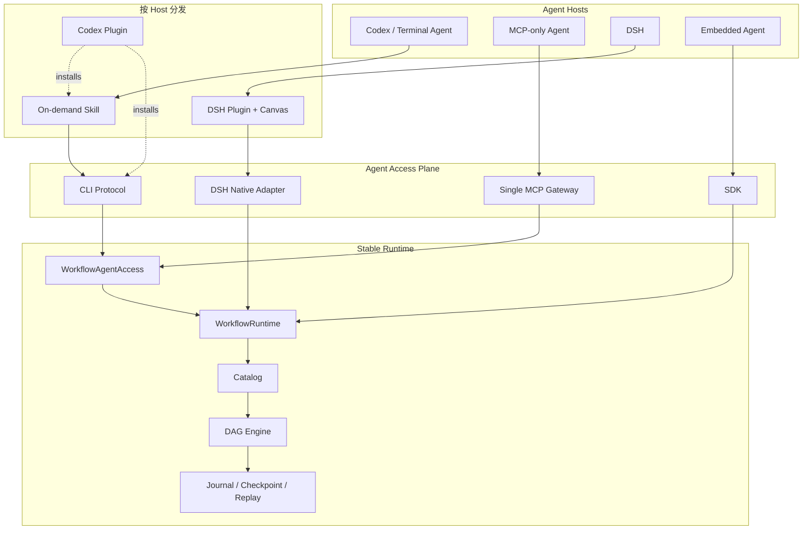

# Agent Workflow 访问架构技术方案

> 状态：Implemented
>
> 基线：`main@b98a3c0`
>
> 架构定位：Runtime-centered，CLI-native，MCP-gateway，Skill-on-demand，Plugin-packaged

## 1. 结论

这轮调整不是 Core 重写，而是访问层重构。

现有 `WorkflowTemplate`、Compiler、DAG Engine、Catalog、Journal、Checkpoint、SQLite、Trigger、Canvas 和 DSH Host Adapter 保持不变。需要重构的是 Agent 如何发现、描述、调用和管理 Workflow：

1. `WorkflowRuntime` 继续是所有执行语义的唯一入口；
2. CLI 成为具备本地命令能力的 Agent 的默认调用协议；
3. MCP 采用单一 Gateway 和固定数量的通用 Tool，不再为每个 Workflow 投影 Tool；
4. Skill 只在任务命中时加载，指导 Agent 调用 CLI 或 MCP，不持有执行逻辑；
5. Plugin 只负责特定 Host 的安装、配置、生命周期和 UI，不实现第二套 Runtime；
6. Trigger、SDK、DSH、CLI 和 MCP 产生相同 Run、Journal、权限与恢复语义。

因此改动规模为：

| 模块 | 结论 | 改动级别 |
| --- | --- | --- |
| Core / Template / Compiler / Engine | 不改协议和执行语义 | 无结构性改动 |
| Catalog / Journal / SQLite / Trigger | 保持权威事实模型 | 小幅补充查询接口 |
| WorkflowRuntime | 继续作为唯一执行门面 | 加法式扩展 |
| CLI | 从基本命令升级为稳定 Agent 协议 | 主要改动 |
| MCP | 删除逐 Workflow Tool 投影，改为固定 Gateway | 破坏性重构 |
| Skill | 从“依赖 workflow_* Tool”改为按宿主选择 CLI/MCP | 主要改动 |
| Codex Plugin | 新增轻量发行入口 | 新增适配层 |
| DSH Plugin / Canvas | 继续原生集成同一 Runtime | 小幅对齐 |

本方案不引入 Provider 层，不拆分多个 npm 包，也不增加第二套 Workflow DSL。

## 2. 为什么需要调整

当前实现已经证明同一模板可以通过 SDK、CLI、MCP 和 DSH 执行，但访问层还有三个问题。

### 2.1 MCP Tool 数量随 Workflow 数量增长

重构前的 `WorkflowMcpServer.listTools()` 会把每个已发布 Workflow revision 投影成独立 Tool：

```text
workflow_<id>_r<revision>
```

即使只有一个 MCP Server，只要 Catalog 中存在大量 Workflow，Host 仍可能加载大量 Tool 名称、描述和 JSON Schema。它的上下文开销是 `O(Workflow 数量)`，不适合作为通用 Agent 入口。

### 2.2 CLI 还不是稳定的 Agent 协议

当前 CLI 已支持 validate、draft、publish、run、trace、replay 和 resume，但仍缺少：

- 按需搜索和描述 Workflow；
- 稳定、带版本的机器输出 Envelope；
- stdin JSON 输入和严格 stdout/stderr 边界；
- compact、schema、trace summary 等按需投影；
- Agent 可识别的错误码和退出码；
- foreground/background 一致调用语义。

### 2.3 Skill 与具体 Tool 表面耦合

当前 `workflow-builder` Skill 假设 Host 已提供完整 `workflow_*` Tool 集合。对于只有终端能力的 Codex 类 Agent，这会造成不必要的 MCP 依赖。Skill 应描述意图和安全流程，并按当前 Host 能力选择 CLI 或 MCP，而不是成为执行通道。

## 3. 目标架构



### 3.1 不变量

无论从哪个入口启动，都必须保持以下不变量：

- 运行目标固定为 `workflowId@publishedRevision`，生产调用不隐式追随 latest；
- Runtime 负责输入 Schema、输出 Schema 和节点 `expects` 校验；
- Host Authority 与模板依赖声明取交集，入口不能扩大权限；
- Secret 只由 Host Gateway 解析，不进入 CLI 参数、模板、MCP Tool 描述或 Journal；
- 每次执行都有统一 `runId`、origin、Journal、Checkpoint 和 Replay；
- CLI/MCP/Plugin/Skill 不直接读写 Store；
- Canvas 是同一 Catalog 和 Journal 的投影，不保存第二份 Workflow。

## 4. 共享 Agent Access Plane

CLI 和 MCP 不应分别复制搜索、描述、运行和错误映射逻辑。新增一个很薄的 `WorkflowAgentAccess`，它只编排现有 `WorkflowRuntimeApi`，不成为新的执行引擎或 Provider。

建议接口：

```ts
interface WorkflowAgentAccess {
  search(request: WorkflowSearchRequest, context: AgentAccessContext): Promise<WorkflowSearchResult>
  describe(request: WorkflowDescribeRequest, context: AgentAccessContext): Promise<WorkflowDescription>
  run(request: WorkflowAgentRunRequest, context: AgentAccessContext): Promise<WorkflowAgentRunResult>
  getRun(request: WorkflowGetRunRequest, context: AgentAccessContext): Promise<WorkflowRunProjection>
  trace(request: WorkflowTraceRequest, context: AgentAccessContext): Promise<WorkflowTraceProjection>

  listNodes(request: WorkflowNodeSearchRequest, context: AgentAccessContext): Promise<WorkflowNodeSearchResult>
  validate(request: WorkflowValidateRequest, context: AgentAccessContext): Promise<WorkflowValidationResult>
  getDraft(request: WorkflowGetDraftRequest, context: AgentAccessContext): Promise<WorkflowDraftProjection>
  putDraft(request: WorkflowPutDraftRequest, context: AgentAccessContext): Promise<WorkflowDraftProjection>
  diff(request: WorkflowDiffRequest, context: AgentAccessContext): Promise<WorkflowDiffProjection>
  publish(request: WorkflowPublishRequest, context: AgentAccessContext): Promise<WorkflowPublishedProjection>
}
```

约束：

1. Access Plane 只返回有界、可序列化的 projection；
2. `run()` 最终只能调用 `WorkflowRuntime.launch()`；
3. `trace()` 最终只能读取权威 Journal；
4. Catalog 的 CAS、发布不可变性和 Runtime 校验不能在 Access Plane 中重新实现；
5. 每个请求都携带 Host 解析的 `authorityRef`，不能信任调用参数自报最终 Authority；
6. 所有错误转换成稳定 `code`，同时保留 `runId`、diagnostics 和 operator action。

这个门面解决的是跨入口一致性，不是第三套能力总线。

为避免 Access Plane 绕过 Runtime，`WorkflowRuntimeApi` 需要补充 `searchTemplates`、`readDraft` 和 `diffDraft` 三个加法式控制面方法；`getPublished`、`listNodes`、`validate`、draft mutation、publish、launch 和 trace 继续复用现有方法。Adapter 不直接持有 Catalog Repository 或 Run Store。

## 5. CLI-native 协议

### 5.1 适用范围

默认用于具备本地命令执行能力的 Agent，例如 Codex、Claude Code、OpenCode 和自动化脚本。它们不需要常驻 MCP Tool 定义，只在 Workflow 任务发生时加载 Skill 并执行 CLI。

CLI 继续使用当前单一 npm 包提供的 `agent-workflow` executable。

### 5.2 命令面

执行面：

```text
agent-workflow search <query>
agent-workflow describe <workflow-id@revision>
agent-workflow run <workflow-id@revision>
agent-workflow run-get <run-id>
agent-workflow trace <run-id>
agent-workflow replay <run-id>
agent-workflow resume <run-id>
```

创作面：

```text
agent-workflow nodes search <query>
agent-workflow validate <template-file|->
agent-workflow draft get <workflow-id>
agent-workflow draft put <template-file|-> --expected <revision>
agent-workflow diff <workflow-id> <template-file|->
agent-workflow publish <workflow-id> --expected <draft-revision>
```

`draft put` 根据是否存在草稿执行 create 或 CAS update，但不能自动吞掉 revision conflict。若实现上希望保持显式，也可以保留 `draft create/update`；对外机器协议必须使用同一请求和结果 Envelope。

### 5.3 输入输出协议

Agent 模式必须满足：

- `--format json`：stdout 只输出一个 JSON Envelope；
- `--format jsonl`：仅用于 trace follow/live stream；
- 人类提示、警告和调试日志只写 stderr；
- `--input <file>` 读取输入文件；`--input -` 从 stdin 读取，避免 shell quoting；
- `--detach` 使用 background launch，只返回持久化后的 `runId`；
- 默认不返回完整模板和完整 Trace；
- 非零退出码与稳定错误码同时存在。

统一 Envelope：

```json
{
  "protocolVersion": "agent-workflow.cli/v1",
  "ok": true,
  "data": {},
  "meta": {
    "command": "run",
    "durationMs": 12
  }
}
```

失败示例：

```json
{
  "protocolVersion": "agent-workflow.cli/v1",
  "ok": false,
  "error": {
    "code": "WORKFLOW_INPUT_INVALID",
    "message": "workflow inputs do not match the published schema",
    "diagnostics": []
  }
}
```

建议退出码：

| Exit code | 含义 |
| --- | --- |
| `0` | 命令成功；run 可以是已持久化的 paused 状态 |
| `2` | CLI 参数或协议输入错误 |
| `3` | Workflow/Catalog 校验错误 |
| `4` | Authority/Capability 拒绝 |
| `5` | Workflow 执行失败或 needs_attention |
| `6` | Store、Host Adapter 或传输故障 |

### 5.4 按需读取

`search` 默认最多返回 10 条摘要：

```json
{
  "items": [
    {
      "ref": "ai-model-weekly-report@3",
      "name": "AI 模型周报",
      "summary": "分析最近一周 AI 模型信息并输出 Top 10"
    }
  ],
  "nextCursor": null
}
```

`describe` 必须显式选择视图：

```text
--view summary     元数据和简短说明
--view schema      输入输出 Schema、依赖和风险摘要
--view template    完整不可变模板，必须显式请求
```

`trace` 默认返回运行摘要和失败节点；只有指定 `--events` 或 `--follow` 才读取事件页或流式事件。

### 5.5 配置与 Host 能力

CLI 支持显式配置文件或当前已有的 `--db`、`--host`：

```json
{
  "schemaVersion": 1,
  "database": "./.agent-workflow/workflow.db",
  "hostModule": "./workflow-host.mjs",
  "authorityRef": "local-agent"
}
```

配置文件只能保存引用和路径，不能保存明文 Secret。CLI 不隐式扫描 `.env`；凭据由 Host module、系统密钥链或外部 Secret Manager 在 Tool Gateway 边界解析。

## 6. MCP-gateway 协议

### 6.1 一个 Gateway，不按 Workflow 建 Server

一个 Runtime deployment 对应零个或一个 MCP Gateway。MCP Tool 数量与 Catalog 中的 Workflow 数量无关。

第一版不提供逐 Workflow Tool 投影，也不依赖客户端是否支持动态 Tool 刷新。

### 6.2 Profile 化固定 Tool 集

Invoke profile 固定暴露五个 Tool：

```text
workflow_search
workflow_describe
workflow_run
workflow_run_get
workflow_trace
```

Author profile 在此基础上增加：

```text
workflow_nodes_list
workflow_validate
workflow_draft_get
workflow_draft_put
workflow_diff
workflow_publish
```

Admin/Trigger 运维能力不混入通用 Agent profile。Host 在启动 MCP Gateway 时固定 profile，Agent 参数不能把 invoke profile 升级为 author profile。

### 6.3 通用运行 Tool

`workflow_run` 使用稳定的通用 Schema：

```json
{
  "type": "object",
  "required": ["ref", "inputs"],
  "properties": {
    "ref": {
      "type": "string",
      "description": "Exact published workflow reference, for example weekly-report@3"
    },
    "inputs": {
      "type": "object"
    },
    "mode": {
      "enum": ["foreground", "background"]
    },
    "idempotencyKey": {
      "type": "string"
    }
  },
  "additionalProperties": false
}
```

Agent 先通过 `workflow_search` 找到候选，再通过 `workflow_describe(view=schema)` 读取唯一目标的输入输出 Schema，最后调用 `workflow_run`。Runtime 对真实 published schema 做权威校验，不能信任 Agent 已经正确读取 Schema。

### 6.4 上下文预算

必须建立自动化预算门禁：

- 向 Catalog 插入 1、100、1000 个 Workflow 后，MCP `listTools()` 数量保持不变；
- invoke profile Tool Schema 序列化体积保持常量级；
- `search`、`describe`、`trace` 都有默认 limit 和最大 limit；
- Tool description 不内嵌模板、节点列表或完整 Workflow Schema；
- 完整 template、event payload、artifact 必须显式请求；
- 第一版不实现 promoted workflow Tool，避免重新引入双轨语义。

如果未来真实测量证明少数高频 Workflow 需要原生 Tool Schema，再设计有数量上限的显式 promotion；它不能成为默认发现机制。

### 6.5 Transport

`WorkflowMcpGateway` 保持与具体 transport 解耦，`createWorkflowMcpSdkServer()` 和 `agent-workflow-mcp` 提供标准 MCP SDK/stdio 入口。stdio 进程创建同一个 Runtime/Access Plane，MCP transport 只负责：

- 协议帧；
- Tool list/call；
- MCP request context 到 Host Authority 的解析；
- AbortSignal 和错误映射。

它不能直接访问 SQLite Repository，也不能绕过 `WorkflowAgentAccess`。

## 7. Skill-on-demand

Skill 是 Agent 的操作手册，不是 Workflow Runtime、Tool Bus 或 Catalog。

### 7.1 Skill 应负责

- 判断何时应复用 Workflow，何时只是一次普通 Tool 调用；
- 搜索并描述已有 Workflow；
- 将复杂需求拆成固定 DAG；
- 查询可用节点和 Host Tool；
- 声明精确依赖、输入输出 Schema 和动态结果 `expects`；
- 在发布前执行 validate、diff 和用户确认；
- 运行后读取 run summary，失败时按需读取 Trace；
- 根据宿主能力选择 CLI 或 MCP。

### 7.2 Skill 不应负责

- 在 Skill 文本中携带 Workflow 实现或 Secret；
- 直接读写 SQLite/Catalog；
- 用 shell 绕过 Runtime 调用任意外部能力；
- 假设所有 Workflow 都已经注册成独立 Tool；
- 因为缺少权限而自动扩大 `spec.requires`；
- 把 CLI/MCP 返回的 paused、needs_attention 当作成功。

### 7.3 宿主选择

Skill 的决策顺序固定为：

```text
若存在 agent-workflow CLI → 使用 CLI JSON 协议
否则若存在 workflow_* Gateway Tools → 使用 MCP Gateway
否则 → 明确报告未安装 Workflow Access，不伪造执行
```

Skill 主体只在匹配 Workflow 任务时加载。常驻元数据只保留名称和一句用途描述。

## 8. Plugin-packaged

Plugin 是 Host 安装与生命周期边界，不是 Runtime 边界。

### 8.1 Codex Plugin

Codex 发行包建议包含：

```text
plugin manifest
workflow Skill
agent-workflow CLI 入口或安装检查
可选 MCP stdio 配置
示例和最小配置说明
```

默认启用 Skill + CLI。只有用户需要远程 Runtime、常驻服务或 Host 不允许直接执行 CLI 时，才启用 MCP Gateway。

Plugin 安装不能默认启动后台 MCP/HTTP 服务，不能创建隐式凭据，也不能复制一套 Workflow 数据库。

### 8.2 DSH Plugin

DSH 继续使用原生 Plugin，因为它需要：

- Cordis 生命周期；
- DSH Tool/Agent/Skill Authority 投影；
- Canvas；
- DSH Session 与日志集成；
- 本地恢复协调。

DSH Plugin 与 Codex Plugin 使用同一个 Runtime 和模板协议，但它们不是彼此的依赖。

### 8.3 其他 Agent

| Host 能力 | 入口 |
| --- | --- |
| 本地终端 | Skill/规则文件 + CLI |
| MCP Client | 单一 MCP Gateway |
| Node.js 嵌入 | SDK |
| 自有插件体系 | 薄 Plugin，内部选择 CLI/SDK/MCP |
| 消息或计划任务 | Trigger Adapter，不伪装成 Skill 或 MCP Tool |

## 9. 单包与目录规划

保持一个公开 npm 包：

```bash
npm install @gm-hz/agent-dag-workflow
```

建议增加以下内部目录，不拆发布包：

```text
src/
  access/
    types.ts                 稳定 Agent request/response projection
    access.ts                WorkflowAgentAccess
    errors.ts                跨 CLI/MCP 的错误码
  adapters/
    cli/
      protocol.ts            JSON/JSONL Envelope 与退出码
      run.ts                 命令路由
    mcp/
      gateway.ts             固定 Tool profile
      stdio.ts               可选 transport 入口
    dsh/                     现有原生 Adapter
skills/
  workflow-builder/          唯一 Skill 源
integrations/
  codex/                     Codex manifest 与安装配置
```

源码仍通过 subpath exports 暴露 SDK、CLI、MCP、DSH 和 Trigger。Codex/DSH 的发布物可以有各自 manifest，但不能复制 Core，也不形成需要独立版本匹配的多个 npm Runtime 包。

## 10. Authority 与安全边界

访问层必须 fail closed：

1. CLI profile、MCP profile 和 Plugin 安装不等于获得 Workflow 能力权限；
2. MCP Gateway 从 Host request context 解析 Authority，忽略调用参数中的自报身份；
3. CLI Authority 来自显式 Host module/config，不从 Workflow input 中提取；
4. `workflow_run(ref, inputs)` 只能调用固定 published revision；inline run 只允许显式 development policy；
5. Author profile 与 Invoke profile 在服务启动时隔离；
6. publish 继续要求 draft CAS revision；
7. Agent 只能调用模板 `spec.requires` 与 Host 可见能力的交集；
8. Access 日志只记录引用、hash、runId 和诊断摘要，不记录 Secret；
9. CLI/MCP 中断必须传递 AbortSignal，但已提交的 background run 不因客户端断线丢失；
10. 所有外部调用继续使用稳定 invocationId 和 unknown-side-effect 策略。

## 11. Trace 与复现

Journal 仍是唯一权威 Trace。不同入口只改变 projection：

- CLI `run` 返回紧凑结果和 `runId`；
- MCP `workflow_run` 返回紧凑结果和 `runId`；
- `trace` 默认返回节点状态、失败位置、外部 invocation 摘要和下一步操作；
- 原始 Event 按页读取；
- 大 payload 通过 Artifact 引用按需读取；
- Plugin 可以把同一 Trace 投影为 UI，但不能创建独立日志模型。

Run origin 建议统一记录：

```json
{
  "type": "cli|mcp|dsh|trigger|sdk",
  "source": "host-defined-source"
}
```

跨入口 replay 继续使用原 Run 的 plan snapshot 和 Journal，不依赖发起它的 Skill 或 Plugin 仍然存在。

## 12. 错误模型

CLI 和 MCP 共用稳定错误分类：

| Error code | 含义 | Agent 默认行为 |
| --- | --- | --- |
| `WORKFLOW_NOT_FOUND` | ref 不存在 | 重新 search，不猜测 id |
| `WORKFLOW_REVISION_REQUIRED` | 未固定 revision | describe 后使用精确 ref |
| `WORKFLOW_INPUT_INVALID` | 输入 Schema 不匹配 | 修正输入，不修改 Workflow |
| `WORKFLOW_OUTPUT_INVALID` | 外部动态结果不合法 | 报告数据风险，读取 Trace |
| `WORKFLOW_AUTHORITY_DENIED` | Authority/Capability 拒绝 | 请求授权，不扩大 requires |
| `WORKFLOW_REVISION_CONFLICT` | Draft CAS 冲突 | 重新读取、diff、确认 |
| `WORKFLOW_NEEDS_ATTENTION` | 外部副作用状态未知 | 不自动重试非幂等调用 |
| `WORKFLOW_RUN_FAILED` | 确定性执行失败 | 读取 summary，再按需读 events |
| `WORKFLOW_TRANSPORT_FAILED` | CLI/MCP/Host 故障 | 可重试只读操作；run 先按幂等键查询 |

底层错误保留原始 code 时做一对一映射，不能把所有错误压成字符串。

## 13. 兼容与迁移判断

本项目仍处于早期破坏性重构阶段，本轮不保留逐 Workflow MCP Tool 兼容层。

### 13.1 不需要迁移

- WorkflowTemplate 协议；
- 已发布 revision；
- SQLite Catalog/Run/Journal 数据；
- Node Definition；
- DSH Canvas 数据；
- Trigger Binding。

### 13.2 需要替换

- 删除 `workflowToolName()` 和 published revision Tool projection；
- MCP 测试改成固定 Tool 数量和 search/describe/run 流程；
- Skill 从强制 `workflow_*` authoring tools 改成 CLI 优先、MCP fallback；
- CLI 输出改为版本化 Envelope；
- 文档不再把“每个 published revision 是普通 MCP Tool”作为产品特性。

### 13.3 需要新增

- Catalog 有界搜索和 describe projection；
- `WorkflowAgentAccess`；
- CLI JSON/JSONL 协议；
- MCP invoke/author profile；
- MCP stdio transport；
- Codex Plugin manifest 和安装验证；
- Agent 访问层 conformance tests。

## 14. 实施阶段

### 阶段 A：Access Contract

1. 定义 Agent request/response、错误码、分页和 projection；
2. 在 Catalog 增加有界 search；
3. 实现 `WorkflowAgentAccess`；
4. 用 SDK fixture 验证 Access 不改变 Runtime 语义。

完成门禁：同一个 published workflow 通过 Runtime 和 Access 得到相同输出、run plan 和 Journal 类型序列。

### 阶段 B：CLI-native

1. 增加 search、describe、run-get、draft get/put、diff；
2. 实现 stdin、JSON Envelope、JSONL 和稳定退出码；
3. 支持 foreground/background；
4. 保持显式 Host module 与 Authority；
5. 重写 CLI 文档和 Agent fixture。

完成门禁：一个没有 MCP 的独立终端 Agent 可以仅凭 Skill 和 CLI 完成 search → describe → run → trace。

### 阶段 C：Skill 与 Codex Plugin

1. 重写唯一 `workflow-builder` Skill；
2. 增加 Codex Plugin manifest；
3. Plugin 默认安装/发现 CLI，MCP 保持可选；
4. 验证未安装入口时 Skill 会明确失败，不伪造执行；
5. 验证 Plugin 卸载不影响 Workflow 数据和 Runtime Store。

完成门禁：新 Codex 会话只在 Workflow 请求时加载 Skill，并通过本机 CLI 跑通真实示例。

### 阶段 D：MCP Gateway

1. 删除逐 Workflow Tool projection；
2. 实现 invoke/author 固定 profile；
3. 接入同一 `WorkflowAgentAccess`；
4. 增加 stdio transport；
5. 验证 Authority、AbortSignal、错误和 background run。

完成门禁：Catalog 从 1 增长到 1000 个 Workflow 时，MCP Tool 数量和 Tool Schema 体积不增长。

### 阶段 E：跨 Host 验收

1. AI 模型周报通过 SDK、CLI、MCP Gateway 和 DSH 执行；
2. 对比 outputs、plan snapshot、Journal 事件类别和 Trace summary；
3. 验证 invalid input、authority denied、paused、needs_attention、replay；
4. 验证 tarball 在无 DSH peer 环境可使用 CLI/MCP/SDK；
5. 更新 README、architecture、implementation status 和 examples。

## 15. 测试矩阵

| 测试 | 验证点 |
| --- | --- |
| Access unit | 搜索、描述、projection、错误映射、分页上限 |
| CLI protocol | stdout/stderr、JSON Envelope、stdin、退出码、JSONL |
| CLI process | SQLite 跨进程 run/trace/replay、Host module |
| MCP gateway | 固定 Tool surface、profile 隔离、通用 run |
| Context budget | 1/100/1000 Workflow 时 Tool 数量和 Schema 大小恒定 |
| Skill contract | CLI 优先、MCP fallback、无入口时 fail closed |
| Plugin package | manifest、CLI/Skill 发现、卸载不删数据 |
| Security | exact revision、Authority、requires、Secret、CAS、unknown side effect |
| Conformance | SDK/CLI/MCP/DSH 输出与 Journal 一致 |
| Tarball | 单包导出、无 DSH peer 导入、CLI 可执行 |

## 16. 完成定义

以下全部满足后，本轮访问层重构才算完成：

1. 任意数量的 Workflow 不再导致 MCP Tool 数量增长；
2. Codex 不启用 MCP 也能通过按需 Skill + CLI 执行实际 Workflow；
3. MCP-only Agent 可以通过固定 Gateway 完成同一执行；
4. Skill、CLI、MCP、Plugin 都不包含第二套 DAG 执行逻辑；
5. CLI/MCP 使用同一个 Access Plane，并最终调用同一个 Runtime；
6. published ref、输入输出校验、Authority、Journal、Replay 在所有入口一致；
7. DSH Plugin 和 Canvas 继续工作，Core 中没有新增 DSH 依赖；
8. npm 仍只有一个公开 Runtime 包；
9. AI 模型周报完成跨 SDK/CLI/MCP/DSH 的真实回归；
10. 文档不再把逐 Workflow MCP Tool 投影视为默认能力。

## 17. 最终判断

现有重构方向是正确的，稳定核心已经具备。新的五层定位不要求 fork 或重写 Core，真正需要的是一次集中、可控的 Access Plane 重构：

```text
Core 稳定
Runtime 稳定
CLI 升级为 Agent 原生协议
MCP 收敛为固定 Gateway
Skill 改成按需指导
Plugin 只负责宿主分发
```

它能在不牺牲审计、恢复和权限边界的前提下，降低 Codex 和其他 Agent 的接入与上下文成本，并保持未来 Trigger、消息平台和嵌入式调用共享同一个稳定核心。
