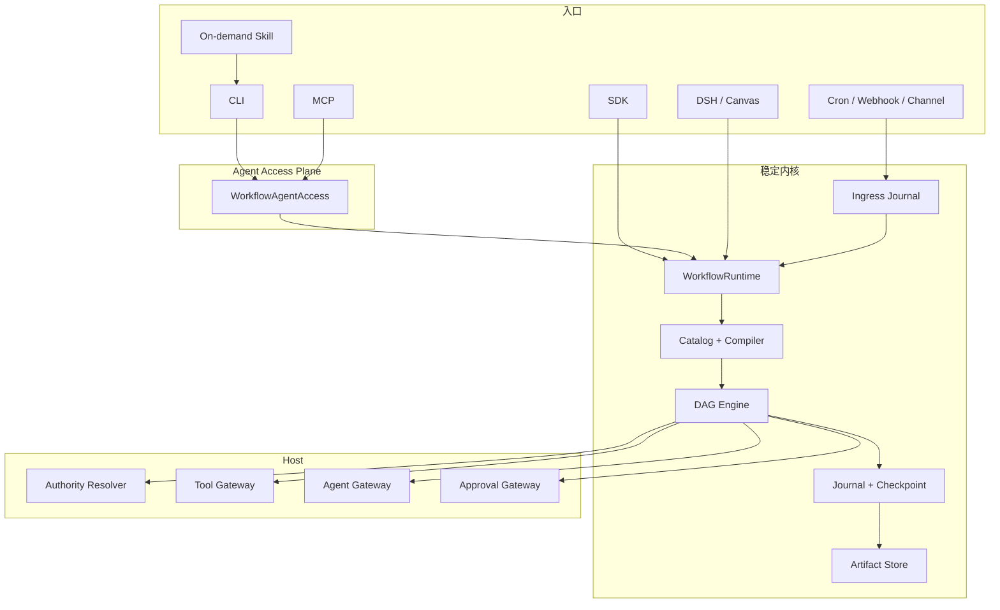

# Agent DAG Workflow 总体架构

本文描述 `1.0.0` 已实现的 Host-neutral 架构。README 给出黄金使用路径，本文只解释稳定边界和执行语义；公开协议以 [Workflow Template v1](../spec/workflow-template-v1.md) 为准。

## 1. 产品边界

Agent DAG Workflow 是可嵌入任意 Agent Host 的持久化 DAG 内核，不是模型、Tool、Skill、MCP、凭据和消息平台的替代品。



Core 负责：模板、编译、拓扑、调度、Schema、依赖、运行状态、Journal、Checkpoint、Replay。

Host 负责：身份与最终权限、Agent/Tool/Skill/MCP 发现、凭据解析、平台日志和消息协议。

## 2. 唯一事实模型

| 实体 | 规则 |
| --- | --- |
| `WorkflowTemplate` | 唯一 JSON DSL；`layout` 不参与 semantic hash |
| `WorkflowDraft` | 可变，使用 CAS draft revision |
| `WorkflowRevision` | 发布后不可变；生产调用必须固定 revision |
| `WorkflowBindingRevision` | 外部 Trigger 到固定 WorkflowRevision 的不可变映射 |
| `WorkflowExecutionPlanSnapshot` | run 创建时锁定根模板、依赖闭包、Engine 与 NodeDefinition set |
| `WorkflowRun` | 一次执行的身份和状态机 |
| `WorkflowEvent` | run 内按 seq 严格有序的权威事实 |
| `WorkflowCheckpoint` | 与 Event batch 原子提交的恢复快照 |
| `WorkflowIngressRecord` | run 创建前的接收、拒绝、去重和 launch 关联 |
| `WorkflowLiveEvent` | 非权威低延迟体验；订阅缓冲有界且允许丢弃旧 delta，断线后以 Journal 为准 |

Draft revision、Published revision、Binding revision、Event seq、Store schema version 是五个不同版本维度，禁止混用。

## 3. 模板与节点边界

模板使用 `workflow.gm-hz.dev/v1`，标准节点为：

| 节点 | 职责 |
| --- | --- |
| `core.start@1` | 输入入口 |
| `core.end@1` | 终态输出 |
| `core.condition@1` | 选择静态输出端口 |
| `core.script@1` | 有界、确定性的纯 JSON 变换 |
| `core.foreach@1` | 对外部调用进行有界批处理、逐项 checkpoint 和恢复 |
| `workflow.call@1` | 调用固定发布修订 |
| `tool.call@1` | 调用 Host Tool Gateway |
| `agent.run@1` | 调用 Host Agent Gateway |
| `human.approval@1` | 暂停并等待 Host 决策 |

外部扩展只有两级：

1. 能表达为一次结构化请求/响应的能力注册为 Host Tool；
2. 需要暂停恢复、进度 checkpoint、补偿或专属容器语义时注册自定义 `WorkflowNodeDefinition`。

Capability Resolver 只是自定义节点的 fail-closed inject 投影，不是第三套 Provider/Tool Bus。

Script 与 Condition/Foreach 分开，因为后两者会改变 Scheduler 的权威状态。纯数组 map/filter/sort 放进 Script；每项需要调用 Tool/Agent/Workflow 时必须使用 Foreach。模板不能携带实现代码、动态 Tool 名、动态图、任意 shell 或无界 while。

## 4. Authority 与能力调用

Core 只持久化 `authorityRef`，不保存 Session、Token 或 Agent 对象。启动和恢复时由 Host 提供或重新解析 Authority，并再次执行 Host policy。

Agent Access 在此基础上增加资源访问隔离：持久化 Run 默认只能被相同 `authorityRef` 读取、Trace、Replay 或 Resume。跨租户运维必须由 Host 显式注入 Access authorizer，不能仅因知道 `runId` 获得数据。

有效能力是以下交集：

```text
NodeDefinition declaration
∩ Workflow spec.requires
∩ node instance tools/skills allowlist
∩ current Authority visibility
∩ Host policy
```

外部调用使用稳定 `invocationId`，并按顺序记录：

```text
commit capability.requested
→ Gateway.execute(invocationId)
→ commit capability.completed
→ validate output
→ commit node.output-committed
```

Gateway 返回后、完成事件提交前崩溃属于未知副作用。非幂等节点不能盲目重试，必须进入 `needs_attention`。

## 5. Runtime、Journal 与 Replay

SDK、CLI、MCP、DSH 和 Canvas 复用 `WorkflowRuntime`：

```text
validate / createDraft / updateDraft / publish
launch / resume / getRun / readEvents / replay
```

`launch()` 先持久化 run 再返回 Handle。`idempotencyKey` 与 Authority scope 生成稳定 runId，并与输入、计划和 deliveryRef 绑定；进程重启或 Trigger 恢复不会创建第二个 run。

每次 Journal commit 必须满足：

- Event seq 连续；
- Event batch 与 Checkpoint 同事务；
- `expectedSeq` CAS；
- 单次 Checkpoint + Event batch 不超过明确的 16 MiB 上限；
- Observer 只在提交成功后接收，且 Observer 失败不影响运行；
- 输出通过 lossless JSON、大小、NodeDefinition Schema 和实例 `expects` 后才能提交。

Replay 分为：

- `inspect`：读取历史状态，不执行节点；
- `recorded`：创建新 run，外部节点使用已提交输出，确定性节点重新计算；
- `live`：创建新 run，重新调用外部能力。

Artifact 使用内容寻址保存捕获数据。Capture Policy 属于部署配置，模板不能放宽它；Secret 明文不能进入 Binding、Event、Checkpoint、Artifact 或 Live Event。
内存与默认 SQLite Artifact Store 不宣称静态加密或自动过期；若部署配置 `encryptArtifacts` 或 `retentionDays`，Store 必须显式声明对应 capability，否则 Runtime fail closed。

## 6. Trigger、Worker 与投递

Trigger 不属于 DAG 图：

```text
Adapter 验签
→ Trigger Envelope
→ Ingress accept/dedupe
→ immutable Binding
→ idempotent launch
→ WorkflowRun
→ Result Delivery
```

Envelope 不接收来源自报的最终 Authority 或幂等键。Ingress 使用 Binding revision、source 和 sourceEventId 生成服务端去重键；Binding 决定固定 Workflow revision、输入映射和 Authority。

Ingress 与 run create 可以同事务，也可以使用“持久 Ingress + 稳定幂等 runId + recoverPending”达到 outbox 等价效果。launch 已成功但关联写入失败时，Ingress 必须保持 `received`，不能误记为 `rejected`。

外部 Trigger 使用 background launch：Ingress 只原子保存 run/queue 事实，不在接收进程执行 DAG；Worker claim 后通过同一个 Runtime `resume` 执行。本地 SQLite Coordinator 提供 queue、claim、lease、heartbeat 和过期接管。它不承诺 exactly-once：多 Worker 仍需要 lease fencing、Journal CAS、稳定 invocationId、Gateway 幂等和 unknown-state 策略共同工作。

Result Delivery 是独立外部副作用，使用 `runId + deliveryRef + phase` 生成稳定 invocationId；状态不明时保留 attempt 并以同一 invocationId 重试，不改变 Workflow 已完成事实。
Canvas 的运维投影可以读取 Binding、Ingress duplicate/run 关联、unknown Delivery 和 Journal Trace；这些仍是同一事实存储的只读投影，不是第二套状态模型。

## 7. 单包与 Adapter 隔离

公开安装只有 `@gm-hz/agent-dag-workflow`。源码目录保持模块边界，发布使用 subpath exports：

```text
./core                协议、编译器、Engine
./runtime             Host-neutral Runtime
./access              Agent 请求/响应投影与稳定错误模型
./journal             Artifact 与 Journal 辅助类型
./sqlite              无 DSH 依赖的本地持久化
./mcp                 MCP 控制面
./cli                 CLI 控制面
./triggers/*          Trigger reference adapter
./dsh                 DSH bundle
./dsh/host            DSH Cordis adapter
./canvas              Canvas Host
./client              Canvas Client bundle
```

根入口、`./runtime`、`./sqlite`、`./mcp` 和 `./triggers` 不允许静态加载 DSH/Cordis。打包前必须清空 `lib/`，避免已删除的旧 Adapter 产物混入 tarball。

## 8. 版本与兼容边界

- Template Parser 只接受 `workflow.gm-hz.dev/v1`，Core 不注册旧 API Version、旧节点别名或双解析路径；
- SQLite 只创建当前完整 schema，或打开 application id 与 schema version 精确匹配的数据库；旧、未知和被篡改的数据库 fail closed；
- 发布修订和历史 Run 不原地改写；节点发生破坏性语义变化时提升 `uses@major`，并创建新的 Workflow revision；
- 协议升级通过独立、显式、可审查的数据转换完成，转换代码不进入 Runtime、CLI 或公开包入口。

因此 Store schema version、Template API Version、Node major、Published revision 和 Event seq 是独立维度，任何一个都不能被另一个隐式替代。

## 9. 验收基准

1. 两节点回显；
2. Condition 分支与 join；
3. Foreach + 子工作流 + 崩溃恢复；
4. AI 模型周报：多路 Tool、Agent 结构化、确定性排序、Top 10；
5. Trigger 重复投递、launch gap 恢复和幂等结果投递；
6. 同一模板通过 SDK、CLI、MCP、DSH 与 Canvas 产生一致契约。

完整门禁见 [Core Verification Harness](core-verification-harness.md)。
