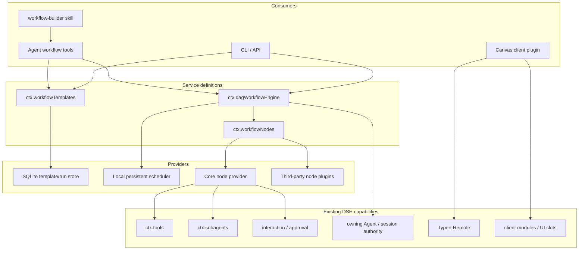
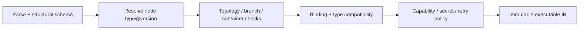

# DSH DAG Workflow 总体架构

## 1. 产品定位

DSH DAG Workflow 是一组可组合插件，而不是一个拥有独立模型、工具、权限和会话体系的平台。它提供四件事：版本化模板、可恢复执行、Agent 生成/调用入口、Canvas 可视化。

现有 DSH dynamic workflow 继续负责一次性的模型生成脚本与大规模 subagent fan-out；DAG Workflow 负责可保存、可审查、可复用和可恢复的确定性流程。二者共享底层能力，但不共享不兼容的输入协议，也不占用同一个 `ctx.workflowEngine` service key。

## 2. 设计原则

1. **模板是唯一事实源。** Skill、Agent 工具、Canvas、CLI 和执行器读写同一份 `WorkflowTemplate`。
2. **Canvas 是投影。** React Flow/Flowgram 坐标放在独立 `layout` 区域；运行编译器忽略它，语义图不包含 UI 库私有字段。
3. **插件节点不绕过 DSH。** `tool` 节点必须调用 `ctx.tools.execute()`，不能直接调用 ToolDefinition；`agent` 节点必须经过 subagent seam；人工确认必须经过 interaction/approval seam。
4. **发布版本不可变。** draft 可以编辑，published revision 固定模板内容、节点类型版本和语义 hash。
5. **恢复不是重跑的别名。** ready queue、边状态、节点尝试、变量池、等待原因和 container frame 都属于 checkpoint。
6. **默认按至少一次设计。** 外部副作用无法承诺 exactly-once；崩溃时状态不明的节点默认进入 `needs_attention`，除非节点声明可安全重试或具备幂等键。
7. **任意环路不进入 v1。** 普通图必须是 DAG；循环只通过 `foreach` 容器表达，避免隐式回边破坏校验、恢复和可视化。

## 3. 能力分层



### 3.1 `ctx.workflowNodes`

节点定义注册表是插件生态的核心。每次注册必须返回 disposer，并在插件卸载后停止新的编译解析。建议定义包含：

```ts
interface WorkflowNodeDefinition {
  readonly type: string
  readonly version: number
  readonly title: string
  readonly description: string
  readonly configSchema: JsonSchema
  readonly inputSchema: JsonSchema
  readonly outputSchema: JsonSchema
  readonly capabilities: readonly string[]
  readonly retry: 'never' | 'safe' | 'idempotent'
  execute(context: WorkflowNodeExecutionContext): Promise<WorkflowNodeExecutionResult>
}
```

Canvas renderer不是 Host 定义的一部分。Client 插件按相同 `type@version` 注册表单/节点 renderer；没有定制 renderer 时使用 JSON Schema 通用表单，保证第三方 Host 节点仍可查看和编辑。

运行开始时解析并租用精确的 `type@version`。插件卸载后拒绝新运行；已接受运行持有 run-owned executor 与清理句柄，遵循 DSH 已有 holder-owned run 语义，不能在运行中静默换实现。

### 3.2 `ctx.workflowTemplates`

负责 draft、revision、发布、校验和查询，不负责调度。核心操作：

- `createDraft / readDraft / updateDraft(expectedRevision)`
- `validate(template, scope)`
- `diff(base, candidate)`
- `publish(expectedRevision)`
- `getPublished(id, revision?) / list()`

更新使用 optimistic concurrency。语义 hash 排除 `layout`，内容 hash 包含完整模板。发布时锁定节点版本；缺失节点、版本迁移失败、能力不可见或 secret 引用无效都必须失败。

### 3.3 `ctx.dagWorkflowEngine`

建议沿用 DSH `start() -> run handle` 风格，但不要扩展现有 script-based `WorkflowStartRequest`：

```ts
interface DagWorkflowStartRequest {
  readonly template: WorkflowTemplateRef | InlineWorkflowTemplate
  readonly inputs: JsonValue
  readonly parent: Agent
  readonly signal?: AbortSignal
  readonly mode?: 'foreground' | 'background'
}

interface DagWorkflowRun {
  readonly id: DagWorkflowRunId
  readonly result: Promise<DagWorkflowResult> // 永不 reject
  cancel(reason?: string): void
  dispose(): Promise<void>
}
```

首版只做 foreground；background 后续接 DSH job/schedule 能力。Canvas test run 也应建立明确的 Agent/Session 归属，不能用无 authority 的匿名 Host 调用绕过 scoped tool 与 approval 策略。

## 4. 编译与执行

### 4.1 编译流水线



结构校验和语义校验分开。JSON Schema 只负责 envelope；唯一 ID、上游引用、端口、类型兼容、DAG、subworkflow 递归深度与插件可用性由编译器产生结构化 diagnostics：

```ts
interface WorkflowDiagnostic {
  code: string
  severity: 'error' | 'warning'
  message: string
  nodeId?: string
  path?: readonly (string | number)[]
}
```

生成器和 Canvas 都消费同一 diagnostics，使 Agent 能定点修复、UI 能高亮节点。

### 4.2 调度语义

每条边状态为 `unknown | taken | skipped`。普通节点在所有入边不再 unknown 且至少一条入边 taken 时 ready；条件节点将选中端口的边标记 taken，其余标记 skipped。这样分支汇合、跳过传播和并行 join 不依赖隐式拓扑猜测。

节点状态建议为：

```text
pending -> ready -> running -> succeeded
                         |----> failed
                         |----> waiting -> ready
                         |----> cancelled
pending/ready ----------> skipped
running after crash ----> needs_attention | ready(retry-safe)
```

调度器有界并发，队列操作与节点状态迁移必须在一个持久事务内提交。一个节点成功后依次提交：输出快照、节点终态、出边状态、后继 ready task、run event；提交成功后才能向观察者发布。

### 4.3 事件与 checkpoint

独立 workflow run store 保存完整事件和 checkpoint；DSH Session log 只保存需要在会话中重放的摘要事实，例如 run start/end、node start/end、pause。最终输出仍由正常 `workflow_run` tool result 写入 Session，满足 DSH “model-visible means logged”。

最小 run event：

- `run.started / run.completed / run.failed / run.cancelled / run.paused`
- `node.ready / node.started / node.progress / node.completed / node.failed / node.waiting / node.skipped / node.needs-attention`
- `edge.taken / edge.skipped`
- `checkpoint.committed`

每个事件包含 run-local 单调 `seq`。checkpoint 保存模板/hash、节点输出与进度、节点/边状态、ready queue、node run count、container frame、depth ceiling 与 pause reason。v1 每个节点一次正常尝试；崩溃后的 retry 由 provider `retry` 声明与 operator decision 控制。人工节点进入 waiting 前必须先提交 checkpoint。

## 5. 首批节点

| Node | Execution path | v1 约束 |
|---|---|---|
| `core.start@1` | 验证并暴露 workflow inputs | 唯一 |
| `core.end@1` | 组装 workflow outputs | 至少一个 |
| `dsh.tool@1` | `ctx.tools.execute()` | 重新执行全部 DSH policy；默认崩溃后不自动重试 |
| `dsh.agent@1` | `ctx.subagents` | parent 归属明确；输出可选 JSON Schema |
| `core.condition@1` | 受限表达式/JSON Logic | 禁止 `eval` 和任意 JS |
| `core.foreach@1` | 显式容器 frame | 有界 item 与并发数，不允许普通回边 |
| `core.subworkflow@1` | 调用固定发布 revision | 发布时检查依赖环和最大深度 |
| `dsh.human-approval@1` | interaction/approval + checkpoint | resume token 一次性、带 authority |

HTTP、代码、知识库、数据库不先做专属节点；它们通过 `dsh.tool@1` 使用 DSH 插件注册的工具。只有当某能力需要独有的 Canvas、流式或 checkpoint 语义时，再增加专属节点。

## 6. Agent 与 Skill 生成闭环

引导 skill 不直接拼接并落盘 YAML。它驱动一组受验证工具：

- `workflow_nodes_list`：返回当前 Agent scope 可用的节点类型、版本和 schemas。
- `workflow_draft_create/read/update`：维护带 revision 的 draft。
- `workflow_validate`：返回结构化 diagnostics。
- `workflow_diff`：生成前后节点/边/config 差异。
- `workflow_publish`：只有无 error diagnostics 且 expected revision 一致时发布。
- `workflow_run`：执行 published revision 或显式 inline draft test run。

skill 流程借鉴 Dify 的 planner/builder 拆分，但由 DSH Agent 完成：

1. 澄清目标、输入、输出、外部副作用和人工确认点。
2. 查询当前 scope 的节点/tool catalog，禁止臆造插件名。
3. 先生成只含 node id/type/purpose/edges 的 topology plan。
4. 再按节点 schema 填充 config 与 bindings；大型图可有界并行构建节点配置。
5. 只做确定性修复，例如默认 layout、缺省端口、稳定 ID；有多种语义解释时回问用户。
6. 循环 `validate -> 定点修复`，展示 diff 后再发布。
7. 发布后可选择立即 test run，并把 run id 交给 Canvas。

## 7. Canvas 插件

Canvas 建议用 `@xyflow/react` 起步，不把 Coze Flowgram 或 Dify Canvas 代码直接搬入项目。DSH Client 插件通过 `dsh.client` 加载，使用 Typert Remote 调用 template/run services。

推荐 UI 装载方式：

- 在 `shell.overlay` 注册一个全屏 Workflow Studio overlay，避免替换 `ui-layout` 的 root 或永久占用窄 details panel。
- 提供一个轻量浮动入口；生成 skill 创建/更新 draft 的 Remote event 也可自动打开对应 draft。
- 运行节点和聊天中的 workflow run renderer 可打开同一个 overlay，并定位到 run/template/node。
- overlay 内包括 node palette、Canvas、schema form、diagnostics、test inputs、run trace、diff/publish。

Client 节点 renderer 也是 effect 注册并可卸载。Host 返回 node type 元数据与 JSON Schema，Client 自定义 renderer 只增强体验；不能成为模板可执行性的必要条件。

## 8. 插件/包拆分

首版采用独立 monorepo，不修改 DSH 上游；共同演进的 definition/provider 被合并为五个公开包：

```text
packages/
  core/       # protocol/compiler/scheduler/core nodes/run-store contract
  catalog/    # draft CAS/diff/published revisions
  dsh/        # Cordis services, DSH nodes, Agent tools, bundled Skill
  sqlite/     # template/run SQLite providers and migrations
  canvas/     # Typert Remote, shell overlay, XYFlow Studio
```

所有注册都通过 Cordis effect，并测试 dispose 后注册项消失。Canvas Client 另暴露 renderer registry 与 `workflowCanvasUi` navigation controller，供第三方节点和 Session renderer 扩展。

## 9. 交付阶段

### Phase 0：可执行内核 spike

- Template v1 parser/validator/diagnostics。
- Node registry 与 plugin disposal/版本解析。
- 内存 scheduler：start/end/tool/condition、分支与 join。
- `workflow_run` tool，通过真实 DSH tool pipeline 执行节点。

退出标准：无 Canvas 也能由固定 YAML 完成真实组合测试，Session 中可重放 run 摘要。

### Phase 1：持久运行

- SQLite template/revision/run event/checkpoint。
- crash recovery、cancel、retry policy、output cap。
- agent、foreach、subworkflow、human approval。

退出标准：进程在任意 node boundary 重启后可恢复；不安全副作用不会被静默重放。

### Phase 2：生成体验

- Agent CRUD/validate/diff/publish tools。
- `workflow-builder` skill。
- tool/node catalog 路由与结构化修复。

退出标准：从自然语言到可发布模板全链路不需要手改 YAML，错误能定位 node/path。

### Phase 3：Canvas

- full-screen overlay、通用 schema form、定制核心节点 renderer。
- test run trace、节点输出检查、diff、optimistic concurrency。
- run/Session 跳转。

退出标准：Skill 生成和 Canvas 编辑互相可见且不发生 DSL 转换损失。

## 10. 主要风险

- **DSH 仍是 developer preview。** 锁定 DSH revision，用一层 adapter 封装 Typert、slot 与 service key；模板协议自行版本化。
- **插件卸载与长运行冲突。** engine start 时租用 node definitions；卸载只阻止新 run，现有 run 必须继续或以明确原因取消并清理。
- **副作用重放。** 默认不自动重试未知结果的 tool 节点；逐步引入 idempotency capability，不能用 checkpoint 冒充 exactly-once。
- **模板携带 prompt 与 secret。** secret 只能保存 reference；执行时重新做 scoped capability/approval 检查；模板发布不代表授予权限。
- **Canvas 反客为主。** 运行 schema 与 UI state 分离；任何无 Canvas 的 Agent/CLI 都能完整创建、校验和执行模板。
- **参考项目许可证。** 设计思想可借鉴，代码复制必须逐文件确认许可；Dify 是 modified Apache-2.0，前端还有额外条件与外观声明。
