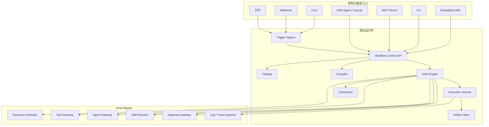

# Agent DAG Workflow 核心通用化重构方案

> 状态：Proposed
>
> 目标分支：`codex/generalize-workflow-core`
>
> 基线：`main@4e4f40a`
>
> 目标版本：`0.3.0`（破坏性重构，不保留运行时兼容层）

## 1. 决策摘要

本次重构不另写一套引擎，也不继续拆分更多 npm 包。现有编译器、DAG 调度器、Checkpoint、Catalog、SQLite、Canvas 和 DSH 集成继续作为实现基础，重构为：

```text
一个仓库
一个公开 npm 包
一种 WorkflowTemplate JSON
一个稳定执行内核
多个按需启用的 Host / Control / Trigger Adapter
```

公开安装保持一次完成：

```bash
npm install @gm-hz/agent-dag-workflow
```

包内通过 subpath exports 暴露不同入口，而不是要求用户安装一组相互匹配的包：

```ts
import { WorkflowRuntime } from '@gm-hz/agent-dag-workflow'
import { createDshAdapter } from '@gm-hz/agent-dag-workflow/dsh'
import { createMcpServer } from '@gm-hz/agent-dag-workflow/mcp'
import { createCronTrigger } from '@gm-hz/agent-dag-workflow/triggers/cron'
```

包名是工作名，发布前再检查 npm 可用性。Core、模板协议和序列化数据中不再出现 DSH 标识；DSH 只存在于 `dsh` Adapter 入口。

## 2. 产品定位

重构后的产品不是另一个 Coze/Dify 平台，而是一个可嵌入任何 Agent Host 的持久化 DAG 执行内核：

> 将 Agent、Tool、Skill、MCP 和受控本地能力编排为可保存、可校验、可恢复、可审计、可重放的 WorkflowTemplate。

内核负责流程稳定性，宿主负责能力生态：

| 内核负责 | 宿主或 Adapter 负责 |
| --- | --- |
| 模板、编译、拓扑和绑定 | 模型与 Agent Runtime |
| 节点调度、并发和状态机 | Tool、MCP Tool 和 Skill 发现 |
| Schema、依赖和结果契约 | 身份、凭据和最终权限判断 |
| Journal、Checkpoint 和 Replay | DSH Session、CLI、钉钉、Webhook |
| 发布修订、恢复和审计 | 消息协议、定时器和平台 API |

## 3. 重构目标与非目标

### 3.1 目标

1. 同一份模板可以由 DSH、CLI、MCP Agent 或嵌入式 SDK 驱动。
2. Core 不导入 DSH/Cordis 类型，不包含 DSH 节点名、能力名和日志格式。
3. 保持两级扩展：通用节点 + 自定义生命周期节点。
4. Tool、MCP 和受控本地命令统一走 Tool Gateway，不建立 Provider 层。
5. Skill 作为 Agent 运行依赖或创作引导，不建立独立调用总线。
6. Execution Journal 成为跨宿主的权威运行记录。
7. Checkpoint 支持恢复，Recorded Replay 支持不调用外部能力的历史复现。
8. Trigger 与 DAG 模板分离，同一发布修订可绑定 Agent、CLI、Cron、Webhook、钉钉等入口。
9. 只有一个公开安装包，并保证未使用的 Adapter 不在运行时加载。
10. 用一套 conformance tests 约束所有 Host Adapter 的语义一致性。

### 3.2 非目标

1. 不建设模型 Provider、凭据中心、Skill 市场或 MCP 市场。
2. 不实现任意 JavaScript/Python `eval` 节点。
3. 不让模板直接执行任意 shell 命令。
4. 不承诺 Agent/Tool 的实时重新执行能产生相同结果。
5. 不在 `0.3.0` 同时完成所有消息平台和分布式调度能力。
6. 不保留 `dsh.workflow/*`、`dsh.tool@1`、`dsh.agent@1` 的双轨运行时兼容。
7. 不为了目录边界继续拆出一组独立版本的 npm 包。

## 4. 为什么采用单包

现有多包结构在实现阶段帮助分层，但对最终用户会带来版本匹配和安装理解成本。通用版本将模块边界保留在源码目录和导出入口中，将发布边界收敛到一个 package manifest。

目标源码结构：

```text
src/
  core/                 模板、编译器、节点定义、DAG 状态机
  runtime/              WorkflowRuntime 门面与后台 Run 协调
  journal/              Event、Checkpoint、Artifact、Replay
  catalog/              草稿、发布修订、diff、语义 hash
  storage/
    memory/             测试和嵌入式使用
    sqlite/             默认本地持久化
  adapters/
    dsh/                DSH Tool/Agent/Skill/Session/Canvas 适配
    mcp/                Workflow 控制面的 MCP Server
    cli/                CLI 控制面
  triggers/
    core/               Trigger Envelope、Binding、幂等入口
    cron/               定时触发适配
    webhook/            HTTP/Webhook 适配
    dingtalk/           钉钉签名、身份和消息回执适配
  canvas/               Host-neutral Canvas 与 DSH 挂载入口
  index.ts              默认 SDK 出口
```

目标导出：

```json
{
  "exports": {
    ".": "./lib/index.js",
    "./core": "./lib/core/index.js",
    "./dsh": "./lib/adapters/dsh/index.js",
    "./mcp": "./lib/adapters/mcp/index.js",
    "./cli": "./lib/adapters/cli/index.js",
    "./canvas": "./lib/canvas/index.js",
    "./triggers": "./lib/triggers/core/index.js",
    "./triggers/cron": "./lib/triggers/cron/index.js",
    "./triggers/webhook": "./lib/triggers/webhook/index.js",
    "./triggers/dingtalk": "./lib/triggers/dingtalk/index.js"
  },
  "bin": {
    "agent-workflow": "./lib/cli.js"
  }
}
```

可选 Adapter 使用动态加载和 optional peer dependency。安装一个包不等于自动启动 DSH、MCP、HTTP Server 或 Cron Worker。

## 5. 目标架构



## 6. 中立模板协议

### 6.1 Envelope

`0.3.0` 使用新的中立 API Version：

```json
{
  "apiVersion": "workflow.gm-hz.dev/v1alpha1",
  "kind": "WorkflowTemplate",
  "metadata": {
    "id": "weekly-ai-news",
    "name": "AI 模型周报"
  },
  "spec": {
    "inputSchema": {},
    "outputSchema": {},
    "requires": [],
    "nodes": [],
    "edges": [],
    "outputs": {},
    "policies": {}
  },
  "layout": {}
}
```

`layout` 仍不参与语义 hash。模板、Agent Builder、CLI、MCP 和 Canvas 使用同一结构，不增加第二套 DSL。

### 6.2 标准节点

| 新节点 | 责任 |
| --- | --- |
| `core.start@1` | 校验并暴露 Workflow 输入 |
| `core.end@1` | 组装终态输出 |
| `core.condition@1` | 固定运算符条件分支 |
| `core.script@1` | 受限、纯 JSON、确定性变换 |
| `core.foreach@1` | 有界批处理容器和 item checkpoint |
| `workflow.call@1` | 调用固定发布修订 |
| `tool.call@1` | 通过 Host Tool Gateway 调用能力 |
| `agent.run@1` | 通过 Host Agent Gateway 执行结构化 Agent 任务 |
| `human.approval@1` | 通过 Host Approval Gateway 暂停和恢复 |

旧 DSH 节点不会在 Core 注册别名。现有示例、数据库 fixture 和测试模板直接迁移到新节点名。

### 6.3 两级扩展规则

第一级是标准节点。普通 HTTP、数据库、DMS、消息、存储、MCP Tool 和受控本地命令都通过 `tool.call@1`。

第二级是自定义 `WorkflowNodeDefinition`。只有需要以下生命周期语义时才允许定制节点：

- 长任务进度 checkpoint；
- 人工等待或外部回调恢复；
- 事务补偿；
- 专属容器控制流；
- 普通 Tool 无法表达的原子提交边界。

自定义 Capability Resolver 是节点能力的 fail-closed 投影，不是第三种 Provider 或 Tool Bus。

## 7. Host-neutral 执行接口

### 7.1 Execution Authority

当前 `owner?: unknown` 重构为明确但保持不透明的 Authority：

```ts
interface WorkflowExecutionContext {
  authorityRef: string
  authority?: unknown
  origin: WorkflowRunOrigin
  traceContext?: {
    traceId: string
    parentSpanId?: string
  }
}

interface WorkflowAuthorityResolver {
  resolve(authorityRef: string, signal: AbortSignal): Promise<unknown | undefined>
}
```

Core 只持久化 `authorityRef`，不持久化 Session、Token 或 Agent 对象。每次恢复由 Host 重新解析，并重新执行宿主权限策略。

### 7.2 Tool Gateway

```ts
interface WorkflowToolGateway {
  list?(authority: unknown): Promise<readonly WorkflowToolDescriptor[]>
  execute(request: WorkflowToolRequest): Promise<JsonValue>
}
```

MCP Tool 在 Host 注册为普通 Tool。模板不包含 MCP Client、Server Token 或连接实现。

受控本地命令也注册为固定 Tool，例如 `local.git.status`，模板不能传入任意可执行文件和 shell 字符串。

### 7.3 Agent 与 Skill

```ts
interface WorkflowAgentRequest {
  invocationId: string
  prompt: string
  inputs: JsonObject
  outputSchema?: JsonSchema
  tools?: readonly string[]
  skills?: readonly string[]
  authority: unknown
  signal: AbortSignal
}
```

Skill 有两种用途：

1. Authoring Skill：指导 Agent 生成和修改 WorkflowTemplate；
2. Runtime Skill：由 `agent.run@1` 声明并交给 Host 加载。

Runtime Skill 进入 `spec.requires`：

```json
{ "kind": "skill", "uses": "financial-analysis" }
```

Skill 不作为一个可以绕过 Agent/Tool 策略的独立执行节点。

### 7.4 WorkflowRuntime 门面

所有入口复用同一个 API：

```ts
interface WorkflowRuntime {
  validate(template: WorkflowTemplate, context?: ValidationContext): WorkflowValidationResult
  createDraft(request: CreateDraftRequest): Promise<WorkflowDraft>
  updateDraft(request: UpdateDraftRequest): Promise<WorkflowDraft>
  publish(request: PublishRequest): Promise<WorkflowRevision>
  start(request: WorkflowStartRequest): WorkflowRun
  resume(request: WorkflowResumeRequest): WorkflowRun
  getRun(runId: string): Promise<WorkflowRunSummary | undefined>
  readEvents(runId: string, query?: EventQuery): Promise<WorkflowEventPage>
  replay(request: WorkflowReplayRequest): WorkflowRun
}
```

CLI、MCP、DSH 工具和 Canvas 只是该门面的授权适配，不复制业务逻辑。

## 8. Execution Journal、Checkpoint 与 Trace

### 8.1 四层边界

| 层 | 是否权威 | 用途 |
| --- | --- | --- |
| Execution Journal | 是 | 不可变运行事实、调用关联和审计 |
| Checkpoint | 是，但属于快照 | 快速恢复当前状态 |
| Trace Projection | 否，可重建 | Canvas 时间线、性能和 OpenTelemetry |
| Host Log | 否 | DSH Session、CLI、MCP/Agent 用户可见记录 |

DSH Log 不再是 Core 的依赖。DSH Adapter 把标准 Journal/Trace 映射为 DSH observer 和 model-visible tool result；Cron、CLI 或钉钉运行不需要伪造 DSH Session。

### 8.2 Event Envelope

```ts
interface WorkflowEventEnvelope {
  schemaVersion: 1
  eventId: string
  runId: string
  seq: number
  type: WorkflowEventType
  occurredAt: number
  workflow: {
    id: string
    revision?: number
    semanticHash: string
  }
  node?: {
    id: string
    uses: string
    attempt: number
    invocationId: string
  }
  correlation: {
    traceId: string
    spanId: string
    parentSpanId?: string
    parentRunId?: string
    causationEventId?: string
  }
  origin: WorkflowRunOrigin
  payload: JsonObject
}
```

首批事件：

```text
trigger.received / trigger.deduplicated / trigger.rejected
run.accepted / run.started / run.resumed
node.scheduled / node.started / node.progress
capability.requested / capability.completed / capability.failed
node.output-validated / node.output-committed
node.completed / node.failed / node.waiting / node.needs-attention
edge.taken / edge.skipped
checkpoint.committed
run.completed / run.failed / run.cancelled / run.paused
```

必须区分“外部调用已返回”和“节点输出已提交”。进程在两者之间崩溃时，恢复流程才能准确判断是使用录制结果、人工决定还是安全重试。

### 8.3 原子提交不变量

保留并强化当前正确设计：

1. Event `seq` 在单个 run 内严格连续；
2. Event batch 与新 Checkpoint 在一个 Store 事务提交；
3. Store 使用 `expectedSeq` CAS；
4. Observer 只在持久化成功后接收事件；
5. Observer、Canvas 或 OTel 失败不能改变执行结果；
6. 节点输出只有通过 lossless JSON、大小、Definition Schema 和实例 `expects` 后才能提交；
7. 已提交的未知副作用不会因为 Host 重启而盲目重放。

### 8.4 Artifact Store

大输入输出不直接重复写入 Event：

```ts
interface WorkflowArtifactRef {
  digest: string
  size: number
  mediaType: string
  redacted: boolean
}
```

Event 保存输入/输出 hash 和 ArtifactRef；SQLite 初版可以把内容寻址 Artifact 存在同一数据库。Secret 永远只保存引用，不能进入 Journal、Checkpoint 或 Artifact。

Capture Policy 由部署者决定，模板不能扩大记录权限：

```ts
interface WorkflowCapturePolicy {
  mode: 'metadata' | 'standard' | 'replayable'
  maxArtifactBytes: number
  retentionDays?: number
  encryptArtifacts?: boolean
}
```

### 8.5 Replay

提供三个明确模式：

| 模式 | 是否调用外部能力 | 用途 |
| --- | --- | --- |
| `inspect` | 否 | 从 Journal 重建历史状态和时间线 |
| `recorded` | 否 | 使用录制的 Tool/Agent 结果重新计算确定性下游 |
| `live` | 是 | 创建新 run，重新调用并与历史 hash 比较 |

`live` 只能称为 rerun，不能承诺 Agent、网络和数据库结果完全相同。Core 不记录隐藏思维链，只记录显式 Prompt、结构化输入、Tool 调用、公开内容和结构化输出，并遵守 Capture Policy。

### 8.6 Journal 查询接口

避免 `loadRun()` 一次加载全部历史：

```ts
interface WorkflowJournalStore {
  createRun(record: WorkflowRunRecord): void
  commit(request: WorkflowCommitRequest): void
  getRun(runId: string): WorkflowRunSummary | undefined
  getCheckpoint(runId: string): WorkflowRunCheckpoint | undefined
  readEvents(runId: string, query: { afterSeq?: number; limit?: number }): WorkflowEventPage
  readArtifacts(refs: readonly WorkflowArtifactRef[]): readonly WorkflowArtifact[]
  listRecoverableRuns(query?: RecoverableRunQuery): readonly WorkflowRunSummary[]
}
```

实时订阅放在 `WorkflowEventBus`，不要求每种 Store 都实现长连接。

## 9. Trigger 模型

### 9.1 Trigger 不属于 DAG 拓扑

Trigger 使用独立的 `WorkflowBinding`，避免同一个流程为了不同入口复制模板：

```json
{
  "apiVersion": "workflow.gm-hz.dev/v1alpha1",
  "kind": "WorkflowBinding",
  "metadata": { "id": "weekly-ai-cron" },
  "spec": {
    "workflow": { "id": "weekly-ai-news", "revision": 3 },
    "trigger": {
      "uses": "cron@1",
      "with": {
        "expression": "0 9 * * 1",
        "timezone": "Asia/Shanghai"
      }
    },
    "inputMapping": {},
    "authorityRef": "service:ai-news-bot"
  }
}
```

同一发布修订可以同时绑定 Cron、Webhook、钉钉命令和 Agent 控制入口。

### 9.2 Trigger Envelope

```ts
interface WorkflowTriggerEnvelope {
  schemaVersion: 1
  triggerId: string
  source: 'cron' | 'webhook' | 'dingtalk' | string
  sourceEventId: string
  receivedAt: number
  occurredAt?: number
  idempotencyKey: string
  authorityRef: string
  payload: JsonObject
  metadata?: JsonObject
}
```

统一处理流水线：

```text
接收 → 验签 → 身份映射 → 幂等去重 → 读取固定发布修订
    → 输入映射 → Input Schema 校验 → 创建 run → 保存回执
```

Trigger 默认按至少一次投递设计。`source + sourceEventId + binding revision` 形成幂等键；重复事件返回已有 run，不创建第二次副作用。

### 9.3 钉钉

支持两种入口：

1. 确定性命令，例如 `/weekly-ai 2026-08-21 2026-08-28`；
2. 自然语言，由宿主 Agent 在允许的发布工作流集合中选择并生成符合 Schema 的参数。

钉钉 Adapter 负责签名、用户/群身份映射、消息去重和最终回执；它不能授予模板未声明或 Authority 未拥有的能力。高风险工作流仍通过 `human.approval@1` 或 Host policy 明确确认。

### 9.4 后台执行前置条件

Cron、Webhook 和钉钉进入生产前必须具备：

- background run；
- Worker lease 与过期接管；
- 幂等 launch；
- 运行超时和取消；
- recoverable run 扫描；
- 失败队列或 operator attention；
- Trigger 回执和最终结果关联。

单进程 SQLite 首版可以完成语义验证，但不能冒充分布式 exactly-once。

## 10. DSH、CLI、MCP 和 Canvas

### 10.1 DSH Adapter

DSH Adapter 继续提供完整体验：

- 将 `ctx.tools` 映射到 Tool Gateway；
- 将 `ctx.subagents` 映射到 Agent Gateway；
- 将 Skill 可见性映射到 Skill Resolver；
- 将 approval 映射到 Approval Gateway；
- 将 owning Agent/session 映射到 Authority；
- 将 Journal/Trace 投影到 DSH observer、标准 Tool result 和 Canvas；
- 保持 DSH policy pipeline，不直接调用 Tool definition。

DSH Market 安装的是同一个公开包的 DSH 入口，而不是另一套 Core。

### 10.2 CLI

```bash
agent-workflow validate workflow.json
agent-workflow run workflow.json --input input.json
agent-workflow run weekly-ai --revision 3 --input input.json
agent-workflow trace <run-id> --follow
agent-workflow replay <run-id> --mode recorded
agent-workflow resume <run-id>
```

CLI 是最短开发反馈链路，也用于 CI。默认只能使用明确配置的本地 Adapter；不会自动继承用户 shell 的全部环境权限。

### 10.3 MCP Server

MCP 暴露控制面 Tool：

```text
workflow_nodes_list
workflow_templates_list
workflow_draft_create
workflow_draft_update
workflow_validate
workflow_publish
workflow_run
workflow_trace
workflow_replay
workflow_resume
```

MCP Agent 和 DSH Agent 调用同一个 Runtime 门面。Tool 的完整结构化结果由协议返回，用户可见文本保持紧凑，不在对话中回显大型模板和 Trace。

### 10.4 Canvas

Canvas 仍然是 WorkflowTemplate 和 Trace 的投影：

- 不保存第二份流程模型；
- 不编码 Host 私有数据；
- 节点表单来自 NodeDefinition Schema；
- DSH 可以挂载 Canvas，其他 Host 也可以通过相同 Control API 使用；
- 默认展示业务 Trace，基础设施 Event 按需展开；
- Recorded Replay 可以在原图上展示历史状态。

## 11. 安全不变量

通用化不能降低当前安全边界：

1. 模板 `spec.requires` 是 allowlist，不是权限授予；
2. 有效能力是 `Node 声明 ∩ Template requires ∩ Authority scope ∩ Deployment policy`；
3. Tool/MCP/本地命令始终通过 Host policy gateway；
4. Script 只允许纯 JSON、无网络、无文件、无密钥、无时间/随机数和无动态代码；
5. Agent 输出在 Checkpoint 前必须通过结构化 Schema；
6. Secret 只保存引用；
7. Trigger 必须验签、映射 Authority 并幂等去重；
8. Replay 默认不产生外部副作用；
9. 未知副作用状态必须进入 `needs_attention`，不能自动猜测成功或失败；
10. Journal Capture Policy 不能由不受信任模板放宽。

## 12. 迁移策略

### 12.1 分支与发布

```text
main                              当前 0.2.x 稳定线
release/0.2                       必要的严重 Bug/安全修复
codex/generalize-workflow-core    0.3.0 通用化重构
```

在 0.3.0 达到验收门禁前，不发布 npm、不修改 DSH Market 稳定条目。

### 12.2 不保留双轨兼容

- Core 不同时注册新旧节点名；
- Parser 不同时接受两个 API Version；
- 不在执行路径中增加 legacy 分支；
- 旧 npm/tag 保留，可继续运行原有 0.2.x；
- 仓库中的示例和测试一次性迁移；
- 如果真实用户数据需要迁移，只提供独立、可删除、非运行时的离线转换命令。

### 12.3 单包收敛

现有 workspace 包按以下顺序收敛到根包源码：

1. Core 和 Catalog 先移动，保持 API 行为；
2. SQLite 移入 `storage/sqlite`；
3. DSH Host 移入 `adapters/dsh`；
4. Canvas 移入 `canvas`；
5. 删除内部跨包版本依赖和重复 package manifest；
6. 根包建立 subpath exports 和单一版本；
7. CI 验证 pack 后一次安装即可获得需要的入口。

移动过程中不同时进行大规模语义修改。先机械收敛并保持测试通过，再中立化协议和重构 Journal，降低定位成本。

## 13. 实施阶段

### 阶段 A：单包基线

- 将现有 workspace 收敛为一个公开 package；
- 保留内部目录边界；
- 建立 subpath exports；
- 所有现有测试和本机 DSH Case 继续通过；
- `npm pack` 后只安装一个 tarball 完成验证。

退出门禁：功能零回归，且源码中不存在内部 npm 包相互依赖。

### 阶段 B：中立 Core

- 修改 API Version、标准节点和能力名；
- 引入 ExecutionContext/Authority；
- DSH 逻辑全部移动到 Adapter；
- 重建示例、Skill 和 Canvas 文案；
- 删除旧协议分支。

退出门禁：Core 源码与测试不出现 `dsh`、Cordis、Session 或 `ctx.*` 类型。

### 阶段 C：Journal 与 Replay

- Event Envelope v1；
- 调用事件、attempt、invocationId、origin 和 trace correlation；
- Journal 分页查询；
- Artifact 和 Capture Policy；
- inspect/recorded/live 三种模式；
- SQLite 原子提交和故障注入测试。

退出门禁：可以在不调用外部 Tool/Agent 的情况下 Recorded Replay 一个复杂运行，并得到相同确定性终态。

### 阶段 D：三宿主验证

- Embedded SDK；
- CLI；
- DSH Adapter；
- MCP 控制面；
- Host Adapter conformance suite。

退出门禁：同一个模板在 SDK、CLI、DSH、MCP 四个入口产生一致的编译结果、依赖拒绝、节点状态和输出契约。

### 阶段 E：后台与 Trigger Core

- background run；
- Worker lease；
- Trigger Binding/Envelope；
- 幂等 ingress；
- Cron 和 Webhook reference adapter。

退出门禁：重复投递不会产生第二个 run，Worker 崩溃后不会盲目重放未知副作用。

### 阶段 F：钉钉与体验收口

- 钉钉命令、自然语言路由和身份映射；
- 消息回执与 run 关联；
- Canvas Trigger/Trace 页面；
- 文档、示例和本机复杂验收。

退出门禁：钉钉重复事件、超时、权限拒绝、人工审批、成功回复和失败重放均有完整 Journal 证据。

## 14. 测试体系

### 14.1 Core 单元测试

- Parser、Schema 和 semantic hash；
- DAG、分支、foreach 和 subworkflow；
- requires、expects、Authority 和 Capability projection；
- 取消、超时、并发和 retry mode；
- deterministic script sandbox。

### 14.2 Store 与故障注入

- Event/Checkpoint 同事务；
- `expectedSeq` 冲突；
- capability 返回后、output commit 前崩溃；
- output commit 后、observer 前崩溃；
- waiting checkpoint；
- Worker lease 过期接管；
- Artifact 损坏和 hash 不一致。

### 14.3 Adapter Conformance

每个 Host Adapter 必须通过同一组测试：

- Tool 参数和 Authority 透传；
- 不可见 Tool/Skill 拒绝；
- Agent 结构化输出校验；
- cancellation 透传；
- invocationId 稳定；
- Host observer 失败不影响运行；
- Secret 不进入 Journal；
- 运行恢复重新解析 Authority。

### 14.4 Replay

- inspect 不执行节点；
- recorded 不调用 Tool/Agent；
- deterministic 节点重算 hash 一致；
- live 创建新 run，不覆盖历史；
- 脱敏或缺失 Artifact 时明确拒绝不可满足的 replay。

### 14.5 Trigger

- 签名错误；
- 身份映射失败；
- 重复 sourceEventId；
- 输入映射错误；
- 固定发布修订；
- 同一事件并发投递；
- 回执失败和重试；
- Cron 时区和错过执行策略。

### 14.6 端到端基准 Case

必须长期保留：

1. 两节点回显：最快 smoke；
2. 风险条件分支：端口与汇合；
3. 批量合同：foreach、子工作流和恢复；
4. AI 模型周报：多路 Tool、Agent、确定性排序、Top 10 和完整 Trace；
5. Trigger Case：Cron/钉钉重复投递与幂等回执。

## 15. 性能与运维基线

初版目标不是极限吞吐，而是稳定、可诊断：

- Journal 分页，Canvas 不一次加载全部事件；
- Artifact 内容寻址，避免 Event 重复保存大对象；
- 单 run Event seq 严格有序，不要求全局顺序；
- 每次 Commit 有明确大小上限；
- Background Worker 有租约、心跳和优雅停止；
- Trace exporter 有界队列，拥塞时不能阻塞 DAG Commit；
- SQLite 保持默认本地体验，Store 接口允许后续实现服务端数据库。

## 16. 主要风险与控制

| 风险 | 控制方式 |
| --- | --- |
| 过度抽象、迟迟不可用 | 只以 DSH、CLI、MCP 三个真实 Host 证明接口 |
| 单包体积过大 | subpath exports、动态加载、optional peer dependency |
| 通用化降低安全性 | Authority + requires + Host policy 四层交集保持 fail-closed |
| Journal 保存敏感数据 | Capture Policy、脱敏、Artifact 加密、Secret reference-only |
| Replay 被误认为确定性重跑 | 明确区分 inspect、recorded 和 live |
| Trigger 重复副作用 | source event 幂等键、固定发布修订、原子 launch |
| 重构范围太大难定位 | 机械单包收敛与语义重构分阶段进行 |
| DSH 用户受影响 | main/0.2.x 保持稳定，0.3.0 门禁通过后再切换 |

## 17. 完成定义

满足以下条件才认为通用化核心完成：

1. 用户只安装一个公开包；
2. Core 序列化协议和源码没有 DSH 标识；
3. DSH 作为 Adapter 仍能运行现有复杂 Case；
4. CLI 可以脱离 DSH 完成 validate/run/trace/replay；
5. 普通 Agent 可以通过 MCP 创建、校验和运行同一模板；
6. Journal 能回答“谁、从哪里、以哪个修订、调用了什么、提交了什么”；
7. Checkpoint 能跨进程恢复，不重跑已经确认提交的副作用；
8. Recorded Replay 不访问外部 Tool/Agent；
9. Trigger 重复投递不会创建重复 run；
10. 全部 Adapter、故障注入、安全和复杂端到端测试通过；
11. 代码中没有旧协议兼容分支和重复 Provider/Tool 总线；
12. README、架构、CLI、MCP、DSH 和 Trigger 文档描述同一套事实模型。

## 18. 当前明确决策

以下事项不再作为开放问题：

- 不新建第二套 Workflow 引擎；
- 不长期维护两个实现仓库；
- 不继续拆更多公开 npm 包；
- 不引入 Provider 层；
- 不为 MCP、Skill、本地命令分别创造调用节点；
- 不把 Trigger 放进 DAG 拓扑；
- 不把 DSH Session Log 当作权威运行记录；
- 不保留 0.2 协议的运行时兼容代码；
- 不在通用 Core 中处理宿主凭据和最终授权。

发布前仍需确认的只有品牌包名、npm 可用性、默认 Artifact 保留期限，以及 `0.3.0` 是否一次包含 Trigger Adapter；这些决策不影响上述核心边界。
